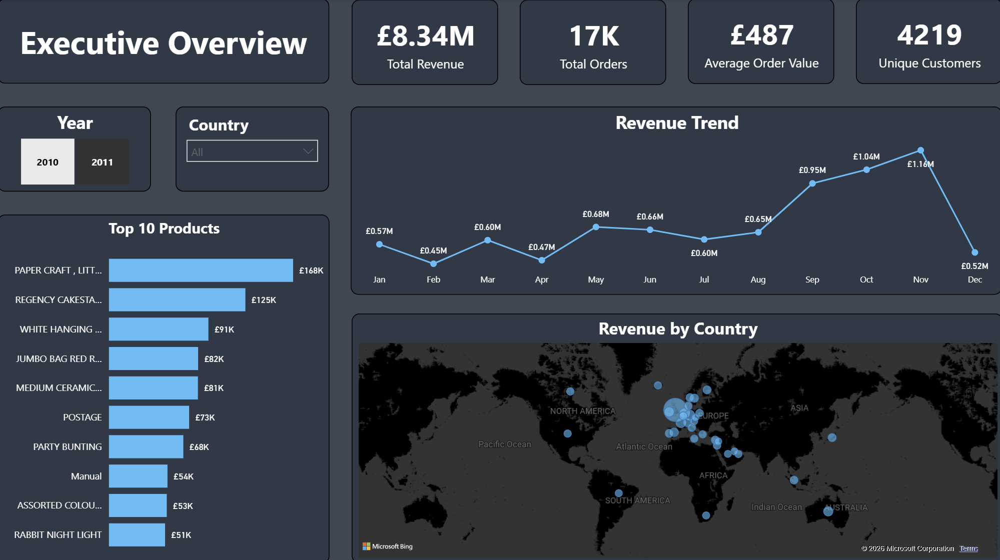
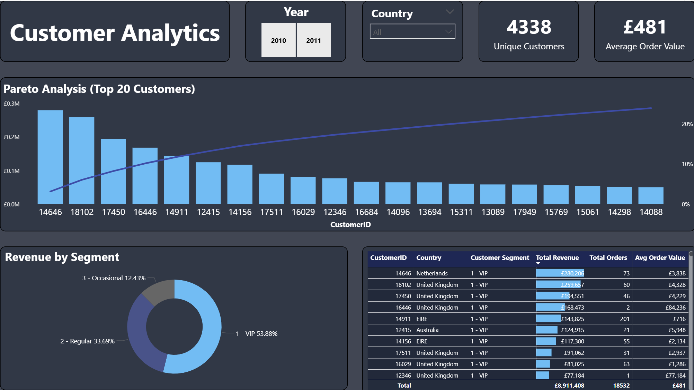
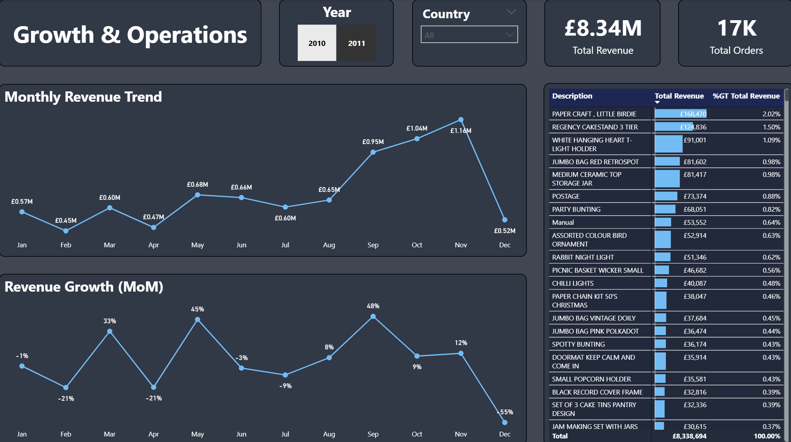
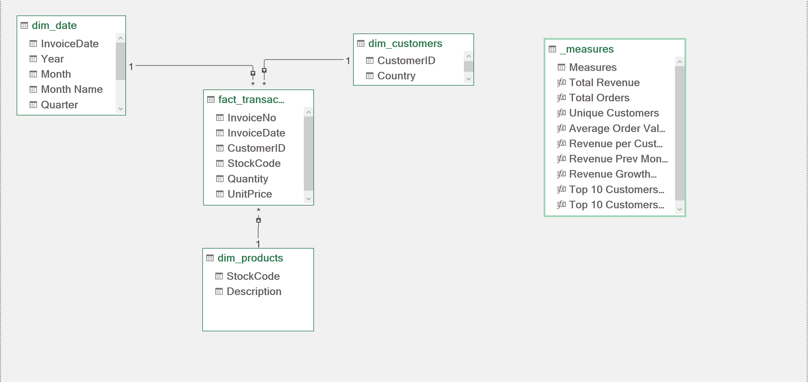

# 📊 E-Commerce Sales & Customer Analytics Dashboard 🛒✨

Welcome to my Data Analytics portfolio project! This repository contains an end-to-end  
Business Intelligence solution designed to extract actionable insights from a transactional retail dataset.

--- 

## 🛠 Tools Used
- Excel
- Power Query (ETL)
- Power Pivot (Data Modeling)
- Power BI
- DAX
- GitHub LFS
---

## 📂 Data Source Description
The dataset used for this project is the Tata Online Retail dataset,  
containing transnational transactions occurring between 2010 and 2011.  
Source:  [TATA: Online Retail Dataset](https://www.kaggle.com/datasets/ishanshrivastava28/tata-online-retail-dataset)

---

# 📄 Dashboard Pages Overview

## 📊 Page 1: Executive Overview
This page provides a high-level summary of business performance, focusing on:

- Total Revenue
- Month-over-Month Growth
- Regional Profitability

---

## 👥 Page 2: Customer Analytics & Segmentation (RFM)

This page identifies the most valuable customers using:

- **RFM Analysis**
- **Pareto Analysis (80/20 rule)**

*(Note: While the Pareto analysis revealed that the top 20% of the customer base drives 80% of  
the total revenue, the visual explicitly highlights the Top 20 absolute VIP customers for focused  
account management)*

---

## ⚙️ Page 3: Growth & Operations

This page analyzes:

- Seasonal trends
- Order volumes
- Revenue concentration risk

These insights help optimize inventory supply and operational planning.

---

# 🧩 Data Modeling Process

The data was cleaned using **Power Query** and modeled into a highly optimized  
**Star Schema** to support fast **DAX calculations** and filtering.

---

# 💡 Top 3 Business Insights

### 1️⃣ Revenue Concentration Risk
The analysis confirmed the Pareto Principle: approximately **80% of total revenue is  
generated by just 20% of the customer base (top 870 clients).** This creates a **revenue  
dependency risk** and highlights the need to diversify the revenue stream.

### 2️⃣ Seasonality Peaks
Sales exhibit strong **seasonality**, with massive spikes during **Q4**.  
Inventory planning should anticipate these historical peaks.

### 3️⃣ Customer Retention Opportunity
Moving **"Potential Loyalists"** into the **"Champions"** segment through targeted email  
campaigns can significantly increase overall **ROI**.

---

# 📁 Comprehensive Project Documentation

For a deeper dive into the project, explore the reports:

- 📄 **[Project Report](Project_Report.pdf)**  
  

